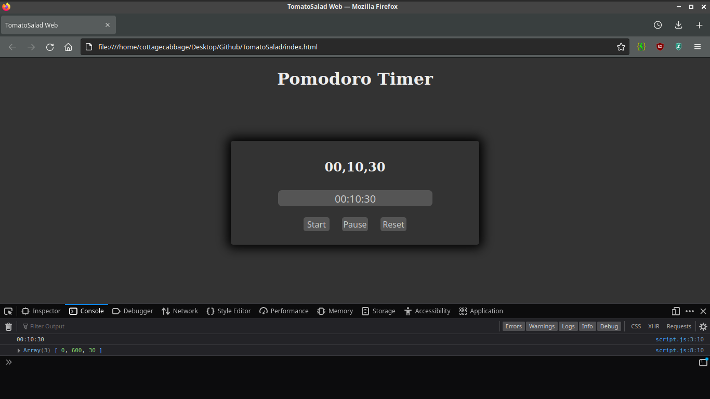

<h1 align='center'>TomatoSalad</h1>
My attempt at making a Pomodoro Timer. Will first try making a Pure-JS one. Make it prettier. Before going web-apps, etc.

	

## Progress:
+ **2021-12-19:** Still fumbling around. The input is set to take a value in the format hours:minutes:seconds and then get an array of these as seconds. 

+ **2021-12-20:** Backtracked on the "Turn-everything-into-seconds" decision. Now input is properly divided into hours, minutes and seconds. Using setInterval, a function is called every 1 second to update the values. First, subtracting seconds one by one until these reach 0. At this point, minutes is subtracted by one, and *secs* are set back to 60. This will go on until minutes also reach zero. If an 'hour' value was set, it will be subtracted by one, minutes will be set to 60 again, and the timer will continue in loop, until every value reaches 0. An alert() will be called then. The timer's values are displayed with both console.log and with innerHTML. 

+ **2021-12-21:** Input and 'start' button will both receive the *disabled* attribute once the latter is pressed. The 'reset' button will enable them again with *.attributes.removeNamedItem*. At the moment, disabled input/buttons don't have any distinction to their enabled counterpart.

### Fix these:
+ ~~*minutes* and *seconds* can be set to above 60.~~ Fixed.
+ in InnerHTML, the values should preferably be displayed in the format 0n if they are below 10.
+ Give warning if input in the wrong format, don't start timer. 

### Do these:
+ Rest timer
+ Loop times

### Repos of Importance: 
+ https://github.com/roldanjr/pomatez (Typescript)
+ https://github.com/karimdaghari/pomotroid (Vue)
+ https://github.com/gnome-pomodoro/gnome-pomodoro (Vala?? Never heard about it. Saving just in case)
+ https://github.com/RoderickQiu/wnr (Electron & Vue?)
+ https://github.com/KeziahMoselle/tempus/releases/tag/v1.7.0 (Electron & React)
+ https://github.com/adrcotfas/Goodtime (Kotlin, ANDROID)
