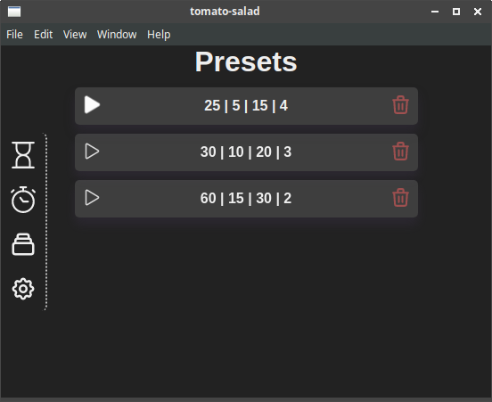

# Tomato Salad
A Vue+Electron Pomodoro Timer. Easy and fast to use.

## Screenshots:

   

---
## Project setup
```
npm install
```
> https://nklayman.github.io/vue-cli-plugin-electron-builder/guide/#to-start-a-development-server

### Compiles and hot-reloads for development
```
npm run electron:serve
```

### Compiles and minifies for production
```
npm run electron:build
```

### Lints and fixes files
```
npm run lint
```

### Customize configuration
See [Configuration Reference](https://cli.vuejs.org/config/).

# Attribution
**ICONS:**
+ https://heroicons.com/
+ https://app.streamlinehq.com/icons/streamline-mini-line

**AUDIO:**
+ https://pixabay.com/sound-effects/search/Windchime/
+ https://www.videvo.net/sound-effect/crowd-cheer-appls-out-pe944402/240755/